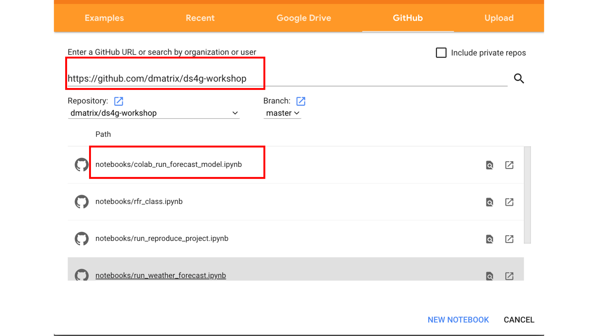

## Introduction to MLflow: Machine Learning Life Cycle Management Platform

Machine Learning (ML) development brings many new complexities beyond the traditional software development lifecycle. Unlike in traditional software development, ML developers want to try multiple algorithms, tools and parameters to get the best results, and they need to track this information to reproduce work. In addition, developers need to use many distinct systems to productionize models.

To solve these challenges, [MLflow](https://mlflow.org), an open source project, simplifies the entire ML lifecycle. MLflow introduces simple abstractions to package reproducible projects, track results, 
encapsulate models that can be used with many existing tools, and central repository to share models,
accelerating the ML lifecycle for organizations of any size.

In this introductory workshop, partly lecture and partly hands-on tutorial, we will cover concepts and motivations
behind MLFlow, cover its four components, and work through a simple example notebook. 

### Goal and Objective
Aimed at beginner or intermediate level, this workshop aims to introduce a data scientist or ML developer in how you 
leverage MLflow as a platform to track experiments, package projects to reproduce runs, use model flavors to deploy in diverse environments, 
and manage models in a central repository for sharing.

### What you will learn

Understand the four main components of open source MLflow—MLflow Tracking, MLflow Projects, MLflow Models, and Model Registry—and how each compopnent helps address challenges of the ML lifecycle.
 * [MLflow Tracking](https://mlflow.org/docs/latest/tracking.html) to record and query experiments: code, data, config, and results.
 * [MLflow Projects](https://mlflow.org/docs/latest/projects.html) packaging format to reproduce runs
 * [MLflow Models](https://mlflow.org/docs/latest/models.html) general format to send models to diverse deployment tools.
 * [Model Registry](https://mlflow.org/docs/latest/model-registry.html) for collaborative model lifecycle management
 * [MLflow UI](https://mlflow.org/docs/latest/tracking.html#tracking-ui) to visually compare and contrast experimental runs with different tuning parameters and evaluate metrics

### Prerequisites

* Python 3, pip, and conda pre installed
* Knowledge on how to use conda
* Knowledge of Python 3 and programming in general
* Preferably a UNIX-based, fully-charged laptop with 8-16 GB, with a Chrome or Firefox browser
* Familiarity with GitHub, git, and an account on Github
* Some knowledge of Machine Learning concepts, libraries, and frameworks
   * scikit-Learn
   * pandas and Numpy
* Loads of virtual laughter, curiosity, and a sense of humor ... :-)

### How to get the Workshop Material
------------------------------------

1. Familiarity with git is important so that you can get all the material easily during the tutorial and
workshop as well as continue to work on in your free time, after the session is over.

```git clone https://github.com/dmatrix/ds4g-workshop.git```

### Setup your conda environment for Jupyter Lab and MLflow
1. `cd ds4g-workshop`
2. `conda create --name jupyter-mlflow`
3. `conda activate jupyter-mlflow`
4. `conda install pip jupyterlab`
5. `pip install -r jupyter_requirements.txt`
6. `python -m ipykernel install --user --name=mlflow`
7. `jupyter lab &`
8. Open the `notebooks/run_weather_forecast.ipynb` notebook. 

### Setup for Google Colab and MLflow
1. Sign up for [Google Colab](https://colab.research.google.com/) (Google account required)
2. Select the **GitHub** tab
3. Insert one of the GitHub Repo URL: 
    * Your cloned github URL or `https://github.com/dmatrix/ds4g-workshop/`
4. Select the ``colab_run_forecast_model.ipynb`` Notebook
5. Run with the MLflow!



### Resources

1. How to use a [conda environment](https://medium.com/@nrk25693/how-to-add-your-conda-environment-to-your-jupyter-notebook-in-just-4-steps-abeab8b8d084) with Jupyter notebook 
2. How to install and use [Jupter Lab](https://jupyterlab.readthedocs.io/en/stable/getting_started/installation.html)
3. How to include or [run other notebooks]( https://vispud.blogspot.com/2019/02/ipynb-import-another-ipynb-file.htm)in a Jupyter notebook
4. [MLflow](https://mlflow.org/docs/latest/index.html)
5. [Numpy](https://numpy.org/devdocs/user/quickstart.html)
6. [Pandas](https://pandas.pydata.org/pandas-docs/stable/reference/index.html)
7. [Scikit-Learn](https://scikit-learn.org/stable/index.html)
